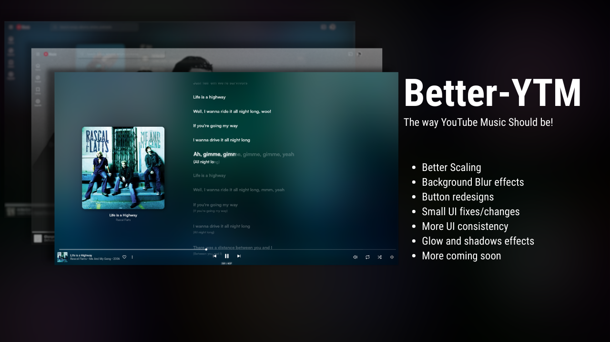
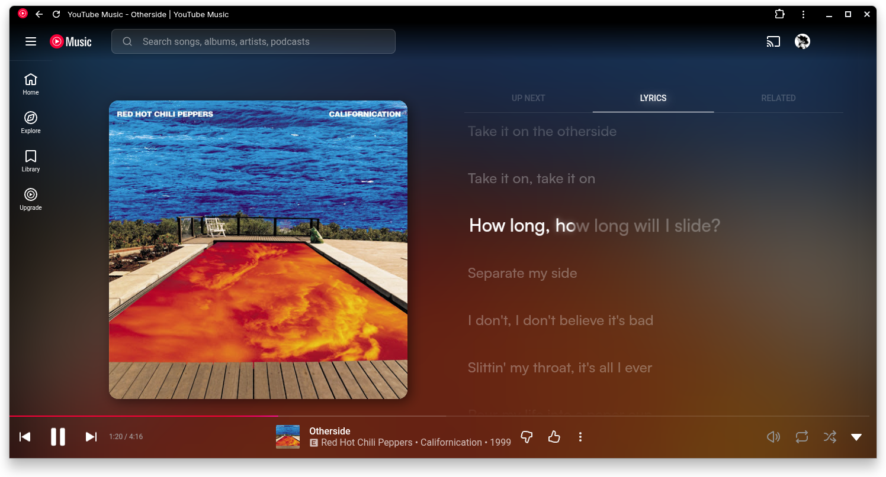
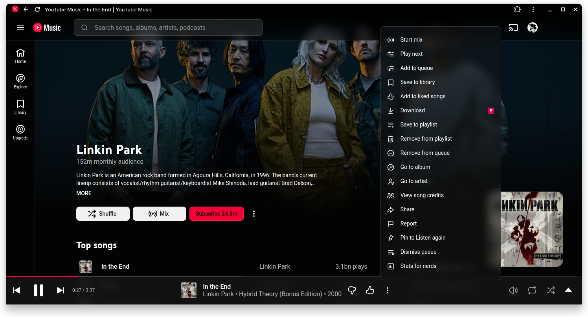
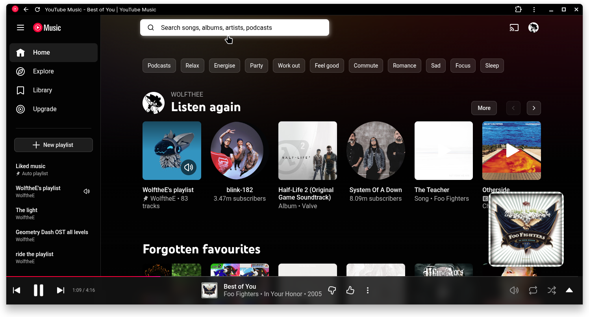

  <h1>Better YTM</h1>
  

## About the Theme
Better YTM is a custom css theme that I created to make youtube music look way more morden. 
I aim to add more animations and more fancy UI effects as well as fix some issues with ytm's UI.
When you load the theme, the first change you will see is the buttons and when you hover over them. You may also see that the UI has more bluring and is more transparent. These 2 are one of the many changes I added!

> [!IMPORTANT]
> While this theme should work without it, this theme is made to work with [Better Lyrics](https://chromewebstore.google.com/detail/better-lyrics-lyrics-for/effdbpeggelllpfkjppbokhmmiinhlmg?hl=en)

## What this themes Adds/Changes
- Buttons
- Searchbar
- Background of Navbar and player bar
- Adds more shadows to some elements
- Animations
- Transparent menus
- Fixed context menu spacing and theming
- And more to come soon!

  
  
  

## Install
Download or copy the style.css theme and load it!
