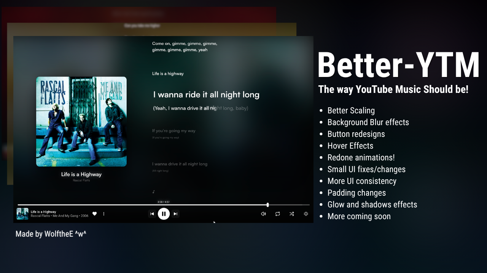
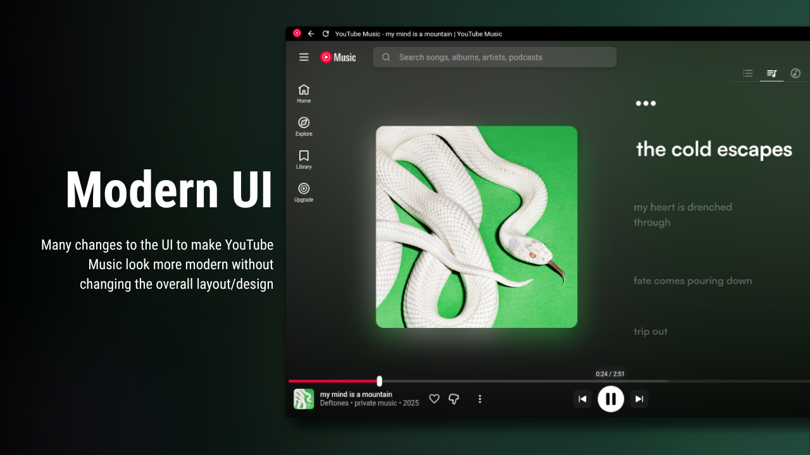
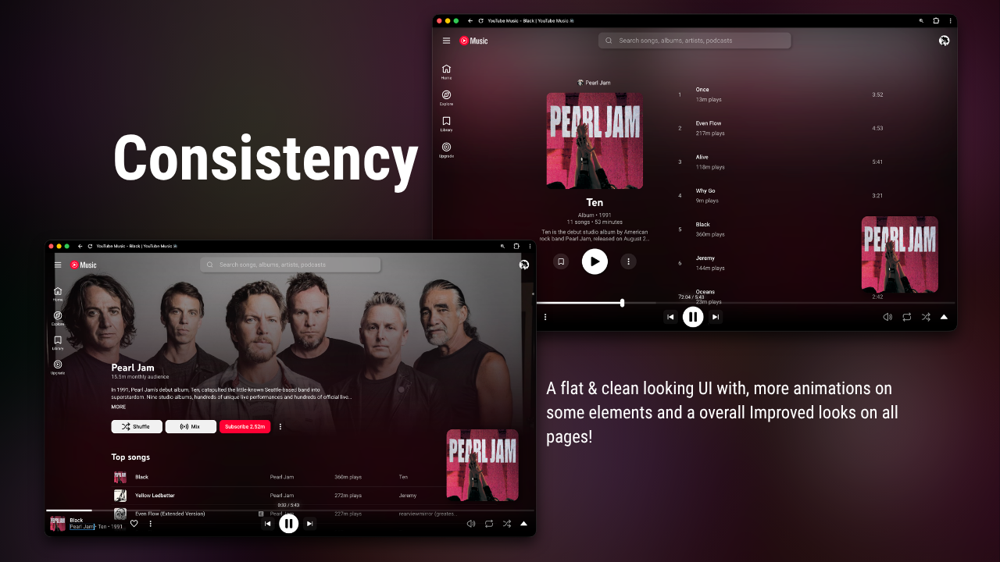
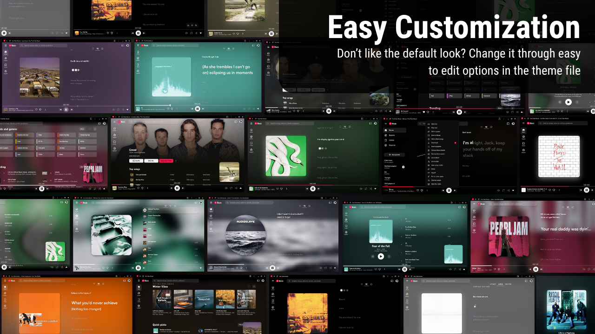

  <h1>Better YTM</h1>
  

## About the Theme
Better YTM is a custom css theme that I created to make youtube music look way more morden. 
I aim to add more animations and more fancy UI effects as well as fix some issues with ytm's UI.
When you load the theme, the first change you will see is the buttons and when you hover over them. You may also see that the UI has more bluring and is more transparent. These 2 are one of the many changes I added!

> [!IMPORTANT]
> While this theme should work without it, this theme is made to work with [Better Lyrics](https://chromewebstore.google.com/detail/better-lyrics-lyrics-for/effdbpeggelllpfkjppbokhmmiinhlmg?hl=en)

The way YouTube Music should have been

# VERSION 2.0 OUT NOW! MAJOR RECODE!

## What this themes Adds/Changes
- Better Scaling
- Background Blur effects
- Button redesigns
- Hover Effects
- Redone animations!
- Small UI fixes/changes
- More UI consistency
- Padding changes
- Glow and shadows effects
- Some Dialog changes
- More coming soon

## Installation Notes
This theme works best with the album art background enabled.
If using a laptop, disable Show stylized animations to save power.

## This version changelog - ver 2.4.0
- Context menu has animations when opening and closing
- Searchbar animations fixed 
- Some small transition easing changed
- Small bug fixes

  
  
  

## Install
Download or copy the style.css theme and load it!
Or get it on the [theme market](chrome-extension://effdbpeggelllpfkjppbokhmmiinhlmg/pages/marketplace.html)
